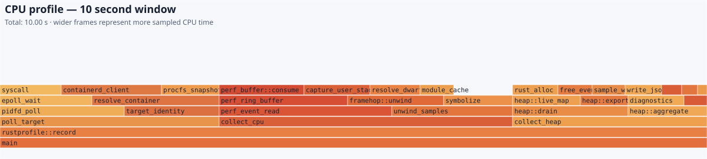
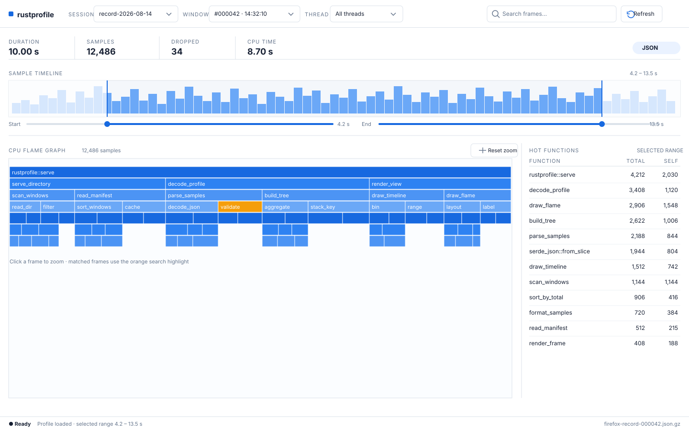

# rustprofile

[English](README.md) | [简体中文](README.zh-CN.md)

`rustprofile` 是面向 Linux 的持续 CPU、off-CPU 与采样堆分析器，支持已有
native 进程、Docker 容器和 Kubernetes 应用容器。它输出 gzip 压缩的 pprof
profile、Firefox processed profile 和诊断 JSON，并可选导出静态 SVG 火焰图
和 OTLP Profiles。`launch` 会先暂停新命令再挂载采集器，`import` 可转换
已有 perf.data/simpleperf，`serve` 提供 Firefox Profiler 所需的符号 API。

## 核心能力

- 按线程采集 CPU 样本和 Rust/libc allocator 的采样堆数据。
- 使用 `--profiles off-cpu` 采集 sched-switch 产生的阻塞区间，并按窗口切分。
- 支持 `--pid`、`--docker-container` 和 `--k8s-pod` 三种明确目标。
- `launch` 在 cgroup v2 上跟踪启动命令的 CPU/off-CPU 子进程；heap 仍只跟踪
  init/root 进程，并在 diagnostics 标记混合 scope。
- 支持 CPU perf 事件的有界时间排序（`--max-pending-events`、
  `--event-reorder-window`）；off-CPU 使用独立的有界区间队列，并支持每窗口
  Firefox JSON/JSLB 输出；`--max-timeline-samples` 默认 65,536，超出的时间线样本
  从启用的 Firefox 或 OTLP 时间线输出中省略，并计入 diagnostics。`--otlp-timeline`
  可将有界、带绝对时间戳的 CPU 时间线发送到 OTLP；本地 CPU pprof 仍保留。
- `import` 读取 perf.data/simpleperf 的 IP/callchain；`serve` 转发符号、源码和
  汇编查询。
- `auto` frame-pointer 校准失败时自动回退到 DWARF。
- 每个窗口原子发布，支持有界保留和目标进程生命周期变化。
- `--svg` 为 CPU、off-CPU 和 heap 输出无脚本的静态火焰图；本地 pprof 和
  diagnostics 始终是权威结果。
- 可选通过 OTLP/HTTP Profiles 输出到兼容的观测系统。

输出发生反压时，output worker 只会为仍在写出的后续窗口暂时舍弃派生输出：可选
SVG、Firefox profile，以及已配置但尚未提交的 OTLP 导出；CPU/off-CPU/heap pprof
和 diagnostics 仍会写出。本窗口的 `output_backpressure` 会记录是否 shed、提交时
的 pending window 数、跳过的派生文件数以及是否跳过 OTLP。OTLP 队列已满则单独将
`otlp.status` 记为 `dropped`，不会删除本地权威文件。

## 前置条件

- CPU profiling 支持 Linux 5.4 或更新版本；heap profiling 需要 Linux 5.12
  或更新版本。Linux 5.4-5.11 应使用 `--profiles cpu`；包含 heap 的请求只有在
  `--allow-partial` 能保留另一种 profile 时才会降级继续。
- native x86_64 或 aarch64，且 profiler 架构必须与目标进程一致。
- `check`、`record` 和 `launch` 需要以 `root` 运行；`import` 与 `serve` 是用户态
  工作流。
- 从源码构建需要 Rust/Cargo 1.88+、clang/LLVM、Linux UAPI headers 和 libelf。

## 快速开始

```sh
cargo build --release

sudo target/release/rustprofile check --pid "$PID" --json
sudo target/release/rustprofile record \
  --pid "$PID" \
  --duration 10m \
  --window 60s \
  --svg \
  --output ./profiles

sudo target/release/rustprofile launch \
  --profiles cpu,off-cpu \
  --firefox-profile json \
  --duration 10m --window 60s --output ./profiles \
  -- ./my-api --port 8080

target/release/rustprofile import \
  --input perf.data --format auto --window 60s \
  --firefox-profile jslb --output ./imported

target/release/rustprofile serve \
  --profile ./profiles/firefox-session-000000-123.json.gz \
  --listen 127.0.0.1:8080
```

使用内置 gallery 浏览目录中的所有 Firefox window：

```sh
target/release/rustprofile serve \
  --directory ./profiles \
  --listen 127.0.0.1:8080
```

Docker 容器使用容器 ID 或名称：

```sh
sudo target/release/rustprofile check --docker-container my-api --json
sudo target/release/rustprofile record \
  --docker-container my-api \
  --duration 10m --window 60s --output ./profiles
```

Kubernetes 使用同节点上的 profiler DaemonSet，并以 `NAMESPACE/NAME` 指定 Pod：

```sh
kubectl exec -n rustprofile-system "$PROFILER_POD" -- \
  rustprofile record --k8s-pod default/api --container app \
  --duration 10m --window 60s --svg --output /profiles
```

## 输出文件

每个完成的窗口可以写出：

```text
cpu-<session>-<index>-<start-unix-nanos>.pb.gz
cpu-<session>-<index>-<start-unix-nanos>.svg
heap-<session>-<index>-<start-unix-nanos>.pb.gz
heap-<session>-<index>-<start-unix-nanos>.svg
off-cpu-<session>-<index>-<start-unix-nanos>.pb.gz
off-cpu-<session>-<index>-<start-unix-nanos>.svg
firefox-<session>-<index>-<start-unix-nanos>.json.gz
firefox-<session>-<index>-<start-unix-nanos>.jslb.gz
diagnostics-<session>-<index>-<start-unix-nanos>.json
```

启用 `--svg` 时，frame 宽度表示采样 CPU 时间或 heap in-use bytes。示例：



profile viewer 的页面布局另有一张静态 UI 预览：



*这是 rustprofile profile viewer 的静态 UI 预览，不是一次真实采集生成的
profile 输出；实际会话会根据选中的 profile 数据填充同样的布局。*

## 部署与限制

Docker profiler 需要 host PID namespace、Docker socket、`--privileged` 以及
perf/eBPF 所需权限。Kubernetes DaemonSet 使用 `hostPID`、privileged security
context 和只读 Pod RBAC；这些都是节点级权限边界。`check`/`record` 的
`--json` diagnostics 当前为 schema version 3，包含 `capabilities`、
`event_order`、`off_cpu`、`firefox`、`jit` 和 `scope`。
启用 OTLP 时还会记录 `otlp.status`、尝试次数、拒绝数量和脱敏错误；启用
`--otlp-timeline` 时增加 `timeline_enabled`、`timeline_samples`、
`timeline_dropped_samples` 与 `timeline_timestamp_errors`。后者统计无法转换为
窗口内 Unix 纳秒时间戳的 perf 样本。

Linux 5.8 或更新版本会优先使用 lifecycle eBPF 事件。Linux 5.4-5.7，或
lifecycle eBPF 无法挂载的更新内核，会回退到每秒一次的 procfs 对账，并在
diagnostics 中记录 warning。

`record --pid` 只跟踪指定 host PID。Docker/Kubernetes 目标的 CPU 和 off-CPU
会按容器 cgroup 周期性对账并纳入后代进程；heap 仍只附着容器 init/root，
因此 diagnostics 的 `scope.effective` 可能是 `mixed_process_and_cgroup`。
`launch` 是显式的子进程工作流：在 cgroup v2 上将暂停的 child 放入临时 cgroup
后再继续；无法创建 cgroup 时只有 `--allow-partial` 才允许退回单 PID。

`import` 不附着 probe，也不做实时 DWARF unwind；导入 pprof 保留原始地址和
PID/TID 标签。`--max-stacks` 限制每个导入窗口的 distinct stack，最多保留四个待
处理时间窗口，线程状态最多跟踪 65,536 个 PID/TID 对。`serve` 必须在
`--profile PATH` 与 `--directory DIR` 中二选一：前者保留 `GET /profile.json`（JSON
返回 `application/json`，JSLB 返回 `application/octet-stream`），后者最多扫描
16,384 个目录项中的 `firefox-*.json.gz`/`firefox-*.jslb.gz`，并最多展示 4,096 个
profile。gallery 通过 `GET /api/profiles` 列出 window、`GET /api/profile/{sha256-filename-id}`
解码 window，`GET /` 返回页面。压缩输入上限为 512 MiB，解压后的 profile 上限为
128 MiB；超过 1 MiB 的 diagnostics 会被忽略。viewer 的 samples/stacks 上限为
65,536，functions 上限为 262,144，threads 上限为 4,096。POST 请求体限制为 8 MiB，
响应限制为 32 MiB。CORS 默认关闭；`--cors-origin ORIGIN` 才会允许精确 origin，
并启用 preflight（未配置时 `OPTIONS` 返回 405）。serve 默认只绑定 loopback，非 loopback 必须设置
`--bearer-token`。自定义 allocator、OTLP gRPC、mTLS
和未验证的生产内核不在当前支持范围内。
Linux 5.4 compatibility path 尚缺独立的原生 5.4 内核运行时验证。

完整的命令选项、OTLP 配置、生命周期语义和发行包安装说明见
[发行包中文手册](dist/README.zh-CN.md)。
